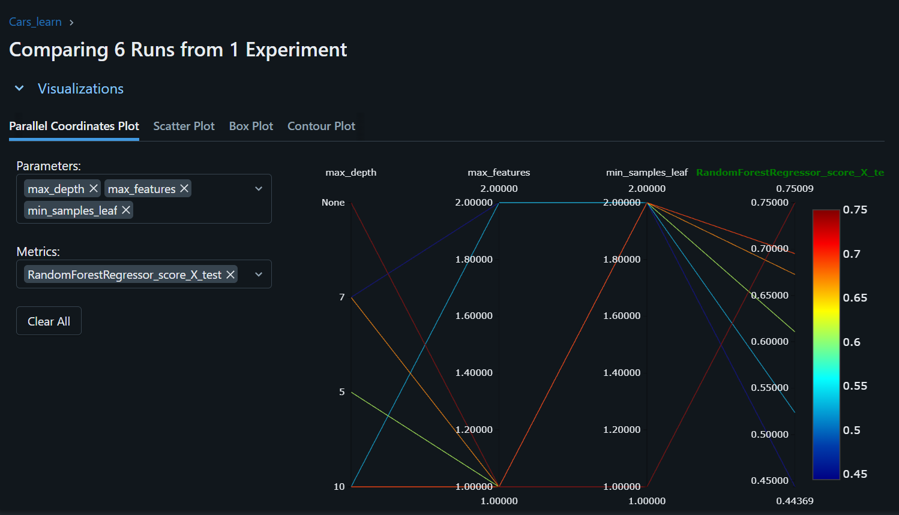
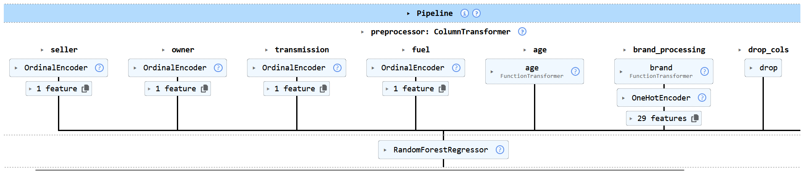
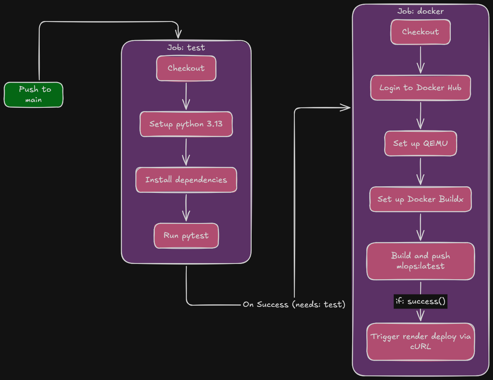

# MLOps End-to-End: Car Price Prediction Pipeline

## 🎯 Project Overview
The main goal of this project is to explore how a data science and machine learning project should be structured and deployed in a real-world production environment. It transitions away from standard Jupyter Notebook experimentation into a fully automated, containerized workflow. 

The project answers two primary questions:
1. How to create a clean, robust API to serve a machine learning model.
2. How to automate the build and push deployment lifecycle.

## 🛠️ Key Technologies
* **scikit-learn:** For data preprocessing, pipeline construction, and model training.
* **MLflow:** For tracking experiments and model selection.
* **FastAPI:** For building a high-performance web API.
* **Pydantic:** For strict data validation and typing of API requests.
* **pytest**: For automated testing to ensure API reliability before deployment.
* **Docker:** For containerizing the application to ensure consistency across environments.
* **GitHub Actions:** For implementing continuous integration and continuous deployment (CI/CD).
* **Render:** For cloud hosting and deploying the containerized API.

---

## 🚀 Project Lifecycle & Methodology

### 1. Model Experimentation & Tracking
The project began by testing various machine learning models using `scikit-learn`. To ensure a structured approach to experimentation, **MLflow** was integrated to track hyperparameters, metrics, and model artifacts across different runs.



### 2. Model Selection
By analyzing the metrics logged in MLflow, the **Random Forest** algorithm seemed the simplest, yet best in performance. The best-performing Random Forest model was registered and extracted for production use.

### 3. Pipeline Construction
To ensure that data preprocessing (handling categorical variables, scaling, etc.) and model prediction happen seamlessly, a clean scikit-learn `Pipeline` was constructed. This prevents data leakage and ensures the incoming API data is transformed exactly as the training data was.



### 4. API Development
A robust API was developed using **FastAPI** to serve the saved model (`model.pkl`). **Pydantic** was utilized to enforce strict data validation on incoming requests, ensuring the model only receives the exact data types and categories it expects (e.g., specific fuel types, transmission, and owner histories).

### 5. Containerization
To eliminate the "it works on my machine" problem, the FastAPI application was containerized using **Docker**. A slim Python 3.13 image was used to keep the container lightweight, installing dependencies via `requirements.txt` and exposing port 8000 for the `uvicorn` server.

### 6. Cloud Deployment
The Docker image was published to DockerHub. From there, a container was spun up and hosted on **Render**, making the `/predict` API accessible over the public internet.

### 7. CI/CD Pipeline Automation
To automate the deployment process, a CI/CD pipeline was established using **GitHub Actions**. Whenever new code is pushed to the `main` branch, the workflow automatically:

Stage 1: Test

  1. Checks out the code and sets up a      Python 3.13 environment.

  2. Installs testing dependencies from `requirements-test.txt`.

  3. Runs pytest to validate the application logic and ensure the API behaves as expected.

Stage 2: Build & Deploy (Requires Test Stage to Pass)

  1. Logs into Docker Hub using encrypted repository secrets.

  2. Builds the updated Docker image using Docker Buildx and QEMU.

  3. Pushes the new latest tag to the Docker Hub registry.

  4. Automatically pings the Render deploy webhook (RENDER_DEPLOY_HOOK) to pull the latest image and update the live production API.



---

## 💻 API Usage

The application exposes a `/predict` endpoint that accepts a POST request with car details to predict its selling price.

**Endpoint:** `POST /predict`

**Request Body (JSON):**
```json
{
  "name": "Maruti Swift Dzire VDI",
  "year": 2014,
  "km_driven": 45000,
  "fuel": "Diesel",
  "seller_type": "Individual",
  "transmission": "Manual",
  "owner": "First OWner"
}
```

**Response (JSON):**
```json
{
  "price": 450000.0
}
```

---

## 🚧 Limitations & Future Scope

While this project successfully demonstrates a core MLOps deployment pipeline, there are several advanced concepts left for future iterations:

### Current Limitations
* **Static Model:** The model deployed is currently static. There is no automated feedback loop to evaluate how the model performs on new, unseen data in production over time.
* **No Drift Detection:** The system currently lacks mechanisms to detect **Data Drift** (when the input data distribution changes) or **Concept Drift** (when the relationship between inputs and the target variable changes).
* **Local/Static Tracking:** While MLflow was used for initial experimentation and model selection, a centralized, continuous MLflow tracking server is not currently monitoring the live production model.

### Future Possibilities (Roadmap)
* **Implement Data Drift Monitoring:** Integrate tools like **Evidently AI** or **Whylogs** to continuously monitor incoming API requests and alert the system if the live data deviates significantly from the training data.
* **Continuous Training (CT) Pipeline:** Extend the GitHub Actions pipeline to include automated model retraining. If data drift is detected or a new batch of data is uploaded, the pipeline should automatically retrain, evaluate, and deploy the new model.
* **Advanced Model Registry:** Utilize a hosted MLflow setup (or similar model registry) to manage model versions dynamically, allowing for easy rollbacks and staging-to-production transitions.
* **A/B Testing or Shadow Deployment:** Before replacing the production model, route a small percentage of API traffic to a newly trained model to compare real-world performance without risking the main user experience.